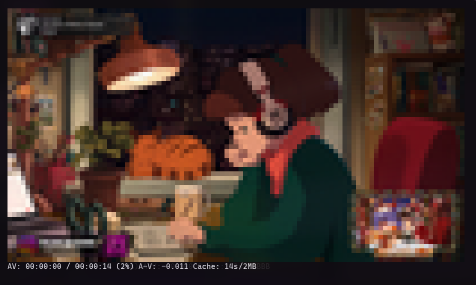
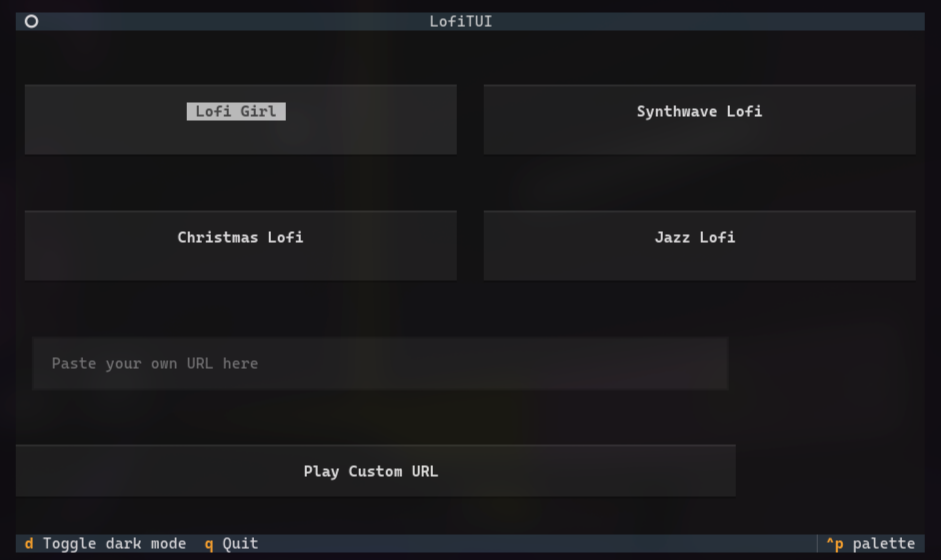

# LofiTUI


A Textual TUI (Terminal User Interface) for playing YouTube lofi streams directly in your terminal using `mpv`. Enjoy your favorite lofi beats with ASCII art video, all from the comfort of your command line.

## Features

* **Curated Presets:** Easily switch between popular lofi streams like Lofi Girl, Synthwave, Christmas, and Jazz.
* **Custom URL Playback:** Paste any YouTube URL to play your own chosen stream.
* **Terminal-based Video:** Renders video as colored ASCII art using `mpv`'s `--vo=tct` output.
* **Audio Playback:** Streams audio in the background via `mpv`.
* **Interactive TUI:** Built with the `textual` library for a responsive and user-friendly experience.
* **Dark Mode:** Toggle dark mode for comfortable viewing.
* **Quit Confirmation:** Prevents accidental exits with a confirmation dialog.

## Screenshots




## Installation


### Prerequisites


Before you begin, ensure you have the following installed on your system:


*   **Python 3:** The application is written in Python.

*   **`pipx`:** A tool to install and run Python applications in isolated environments. You can install it with `pip install --user pipx`.

*   **`mpv`:** A free, open-source, and cross-platform media player. Install it using your system's package manager (e.g., `sudo apt install mpv` on Debian/Ubuntu, `sudo pacman -S mpv` on Arch Linux).


### From Local Source


1.  **Build and install the package:**

    Navigate to the project's root directory and run the following command:

    ```bash

    pipx install .

    ```


## Usage


Once installed, you can run the application by simply typing:


```bash

lofigirl

```


## Uninstallation


To uninstall the application, you can use `pipx`:


```bash

pipx uninstall omarchy-lofigirl

```


This will remove the application and its isolated environment. To remove the data directory created by the application, run the following command before uninstalling:


```bash

lofigirl --uninstall

```


